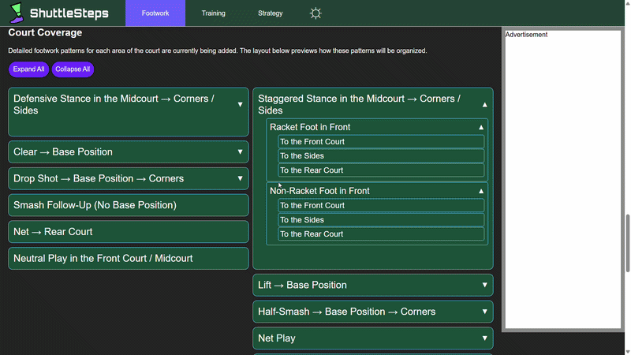
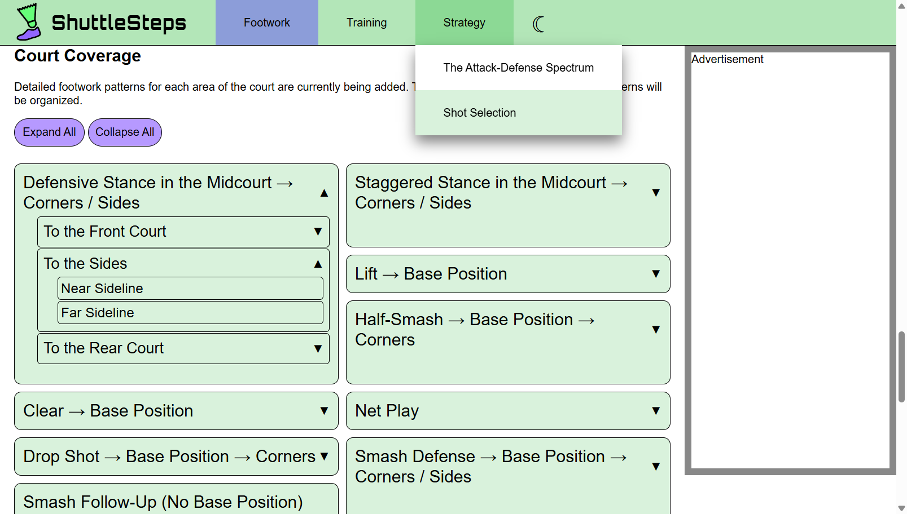
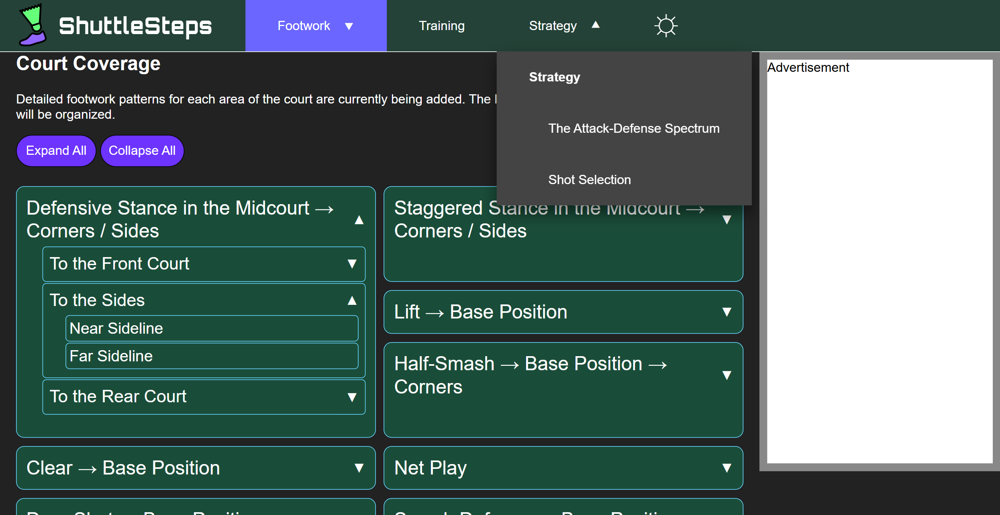
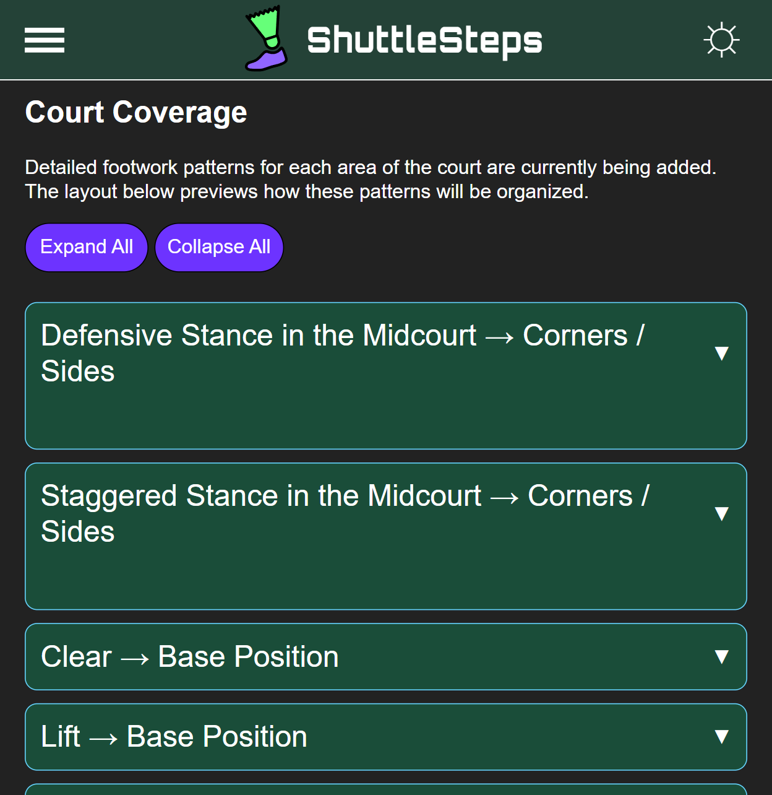
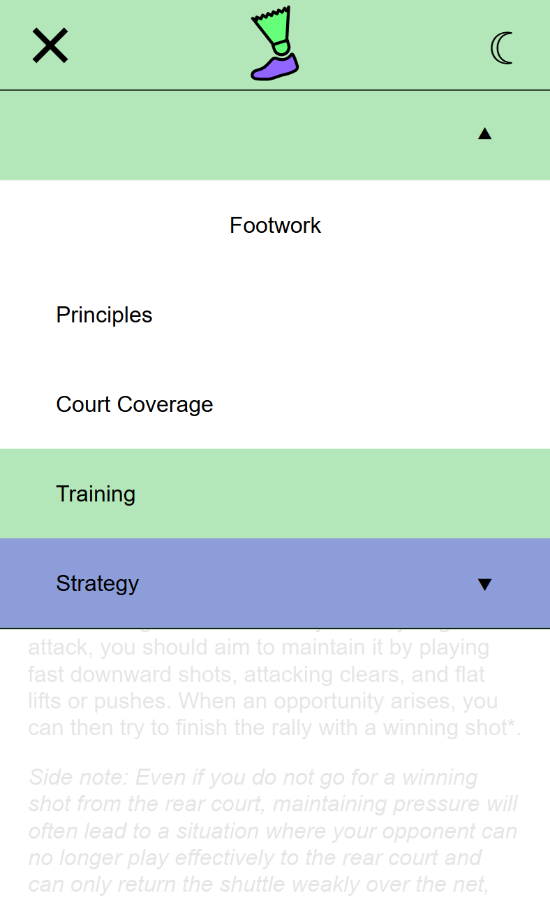
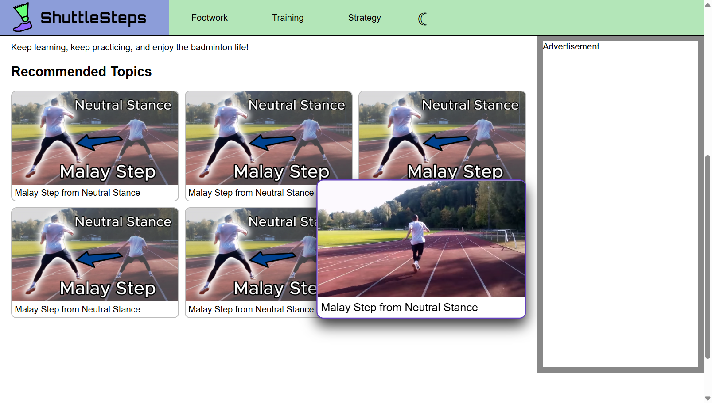

# ShuttleSteps

A simple static website about badminton techniques, featuring structured topics, videos, and video previews

## Live Demo

- [Production version](https://shuttlesteps.com/)
- [GitHub version](https://kim-and-code.github.io/shuttlesteps/)

## Preview

## Features

- Responsive design supporting different screen widths, root font sizes, and device input modes (including dual input support)
- Dark mode
- Video previews
- Reusable UI components (navbar, video cards, footer, cookie banner)

## Tech Stack

Languages:
- HTML
- CSS
- JavaScript

Deployment:
- Netlify
- Cloudinary (preview videos)
- YouTube (full length videos)

## Screenshots

## Demo Video

[▶ Watch Full Demo Video](https://res.cloudinary.com/dfurtwadh/video/upload/v1779268595/demo-video_smosvk.mp4)

## Run Locally

This project uses ES modules, so it must be run on a server.
To run it locally, you can use the VS Code Live Server extension.

## Challenges & Learnings

- Applied fundamentals of HTML, CSS, and JavaScript
- Built a responsive layout using a mobile-first approach
- Went through the full project lifecycle from idea to deployment
- Addressed performance and rendering issues such as layout thrashing and flash of unstyled content (FOUC)

## Future Improvements

- Add Table of Contents with automatic highlight on scroll
- Use scrollbar-gutter property
- Add more content

## License

- Code: MIT
- Content (including text, images, and videos): All rights reserved
